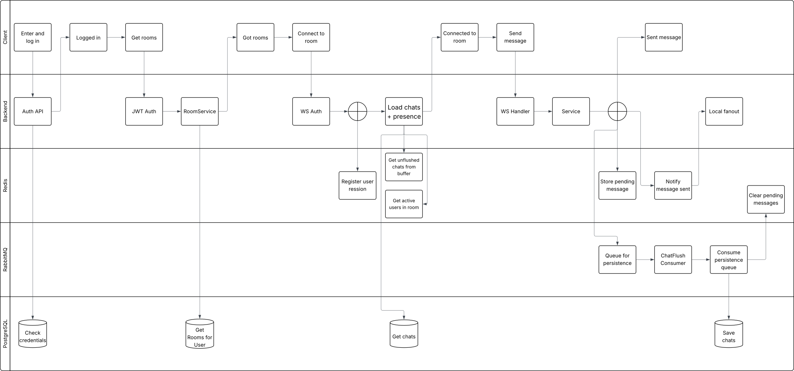

# ChatApp

ChatApp is a distributed real-time messaging service built with Kotlin and Spring Boot.
It supports chat rooms, private DMs, optional AES-256-GCM message encryption, and horizontally scalable WebSocket messaging using Redis Pub/Sub and RabbitMQ.

## [Access](https://chatapp.blikeng.com)

---

### SonarCloud Analysis

[](https://sonarcloud.io/summary/new_code?id=eskil4152_chatapp)
[](https://sonarcloud.io/summary/new_code?id=eskil4152_chatapp)
[](https://sonarcloud.io/summary/new_code?id=eskil4152_chatapp)
[](https://sonarcloud.io/summary/new_code?id=eskil4152_chatapp)
[](https://sonarcloud.io/summary/new_code?id=eskil4152_chatapp)

---

## Table of Contents

- [Tech Stack](#tech-stack)
- [Architecture](#architecture)
- [Features](#features)
  - [Authentication & Security](#authentication--security)
  - [WebSocket & Real-Time Messaging](#websocket--real-time-messaging)
  - [Distributed Messaging Pipeline](#distributed-messaging-pipeline)
  - [Message Encryption](#message-encryption)
  - [Friends & Direct Messages](#friends--direct-messages)
  - [Database & Persistence](#database--persistence)
  - [Room & User Management](#room--user-management)
  - [Presence Tracking](#presence-tracking)
  - [Buffered Message Persistence](#buffered-message-persistence)
- [API Overview](#api-overview)
- [Deployment](#deployment)
- [CI/CD Pipeline](#cicd-pipeline)
- [Testing](#testing)
- [License](#license)

---

## Tech Stack

| Layer             | Technology                                |
|-------------------|-------------------------------------------|
| Language          | Kotlin                                    |
| Framework         | Spring Boot                               |
| Real-time         | WebSockets (Spring WebSocket)             |
| Auth              | JWT (HTTP-only cookie, `SameSite=Strict`) |
| Encryption        | AES-256-GCM                               |
| Password Hashing  | BCrypt                                    |
| Database          | PostgreSQL (schema managed via Flyway)    |
| Messaging         | RabbitMQ                                  |
| Distributed State | Redis                                     |
| Containerization  | Docker                                    |
| Cloud             | Azure Web App + Azure Container Registry  |
| CI/CD             | GitHub Actions                            |
| Code Quality      | SonarCloud                                |

---

## Architecture



The system separates real-time delivery (Redis Pub/Sub + WebSockets) from durable persistence (RabbitMQ + PostgreSQL), 
allowing the chat service to scale horizontally without coupling WebSocket throughput to database writes.

---

## Features

### Authentication & Security

**JWT Authentication**
- Registration and login issue a signed JWT stored as an `HttpOnly`, `SameSite=Strict` cookie with a 24-hour expiration.
- The token encodes `userID` as the subject and `username` as a claim for efficient identity extraction.
- A dedicated `JwtAuthFilter` is responsible for all authentication checks.
- After token validation, user existence is re-verified in the database. A valid token for a deleted user results in 400 Bad Request.

**Password Handling**
- Passwords are hashed with **BCrypt**, plaintext passwords are never persisted.
- Password changes require the current password to be verified against the stored hash before a new hash is saved.
- Minimum length is enforced for both usernames and passwords during registration and password changes.

**WebSocket Handshake Authentication**
- An `AuthHandshakeInterceptor` intercepts every WebSocket request and validates the JWT from the cookie before any connection is established.
- `userID` and `username` are injected into the WebSocket session after validation.
- Room membership is verified before a user can join a WebSocket room session. Unauthorized or non-member connections are rejected.

---

### WebSocket & Real-Time Messaging

- Messages are broadcast in real-time to all active sessions in a room.
- Room session state is managed with thread-safe data structures: `ConcurrentHashMap` for room-to-sessions mapping and `CopyOnWriteArraySet` for per-room session sets.
- WebSocket messages use a typed event structure with centralized exception handling. Four event types are supported: `MESSAGE`, `JOIN`, `LEAVE`, and `PING`.
- Only `MESSAGE` events are persisted to the database. `JOIN` and `LEAVE` are broadcast-only.
- On room join, history is assembled from both the database and the current Redis message buffer to ensure no messages are missed between persistence batches.

---

### Distributed Messaging Pipeline

To support horizontal scaling and decouple real-time messaging from persistence, the application uses a Redis + RabbitMQ pipeline.

**Redis Pub/Sub**
- All WebSocket broadcasts are published to Redis channels (`room:{roomId}`).
- Each instance subscribes to these channels and rebroadcasts messages locally to connected WebSocket sessions.
- This ensures messages reach users connected to different application instances.

**RabbitMQ Message Queue**
- Chat messages are asynchronously persisted through RabbitMQ.
- When a message is sent:
  1. The message is published to RabbitMQ.
  2. A background consumer batches messages and writes them to the database.
- Manual acknowledgements ensure messages are retried if persistence fails.

This architecture separates:
- **real-time delivery**
- **durable persistence**

---

### Message Encryption

Encryption is **optional** and configured per room.

- Rooms can enable **AES-256-GCM** encryption for all messages.
- Each encrypted message stores three fields: `ciphertext`, `nonce`, and `keyVersion`.
- **Additional Authenticated Data (AAD)** binds each message to its specific room, user, and message identifier.
- `keyVersion` allows for future key rotation without losing the ability to decrypt historical messages.

---

### Friends & Direct Messages

- Users can add friends by username.
- Friends can open a private DM conversation, backed by the same WebSocket and message persistence infrastructure as rooms.
- Friend and DM data are fetched via optimized repository queries.
- Friend status is intentionally never exposed to outside parties. Looking up a non-friend returns 
the same response as a non-existent user, preventing user enumeration.

---

### Database & Persistence

**Schema Management with Flyway**
- All tables are version-controlled through Flyway migration scripts, applied automatically on startup.

**Relational Modeling**
- Foreign keys link `users` and `rooms` to `user_rooms` and `chats`.
- The `user_rooms` join table is indexed for efficient lookups when fetching a user's rooms.
- Duplicate room memberships are prevented via database constraints and repository checks.

**DTOs**
- All API responses use Data Transfer Objects to decouple the API surface from internal entity structure and minimize data exposure to clients.

---

### Room & User Management

**Rooms**
- The user who creates a room is assigned the `OWNER` role; users who join are assigned `MEMBER`.
- Membership is stored in the `user_rooms` join table and fetched via an indexed join query.

**Users**
- Duplicate usernames are rejected with `409 Conflict`.
- Login with an unknown username or incorrect password returns `401 Unauthorized`.
- Users can retrieve and update their own profile fields (bio, avatar, etc.) and change their password.

---

### Presence Tracking

User presence is tracked using Redis.

- Each active user session increments a Redis counter.
- When sessions close, the counter is decremented.
- A user is considered online when the counter is greater than zero.

Room presence is also tracked using Redis sets to allow efficient lookup of users currently active in a room.

---

### Buffered Message Persistence

To reduce database write pressure and support high message throughput, message persistence is handled asynchronously.

**Redis Message Buffer**
- Messages are temporarily stored in Redis lists (`chat.peek.{roomId}`).
- This buffer allows newly joined users to retrieve messages that have not yet been persisted.

**RabbitMQ Batch Persistence**
- Messages are also published to a RabbitMQ queue.
- A background consumer batches messages and writes them to PostgreSQL.

**Flush Strategy**
Messages are persisted when either:

- A batch reaches a configured size threshold
- A periodic flush interval is reached

This design ensures:

- consistent message history
- reduced database write amplification
- resilience to transient database failures

---

## API Overview
| Method | Endpoint                | Description              |
|--------|-------------------------|--------------------------|
| POST   | /api/register           | Register                 |
| POST   | /api/login              | Login                    |
| POST   | /api/logout             | Log out                  |
| GET    | /api/auth               | Check auth status        |
| GET    | /api/rooms              | List all rooms           |
| POST   | /api/rooms/make         | Create room              |
| POST   | /api/rooms/join         | Join room                |
| PUT    | /api/rooms/edit         | Edit room                |
| DELETE | /api/rooms/leave        | Leave room               |
| DELETE | /api/rooms/delete       | Delete room              |
| POST   | /api/rooms/dm           | Make or get private room |
| GET    | /api/user               | Get user info            |
| PUT    | /api/user/edit          | Edit user profile        |
| PATCH  | /api/user/password      | Edit password            |
| GET    | /api/friends            | Get all friends          |
| POST   | /api/friends/add        | Add friend               |
| DELETE | /api/friends/remove     | Remove friend            |
| GET    | /api/friends/{username} | Get friend info          |
| WS     | /ws                     | WebSocket endpoint       |

---

## Deployment

The application runs as a Docker container on Azure Web App, with Docker images built and tagged using the 
Git commit SHA and stored in Azure Container Registry.

The CI/CD pipeline handles building, pushing, and redeploying the container automatically on every merge to `main`.

---

## CI/CD Pipeline

Two GitHub Actions workflows run on the repository:

**`testing.yml`** — triggers on every pull request and merge to main:
- Executes the full Maven test suite
- Updates SonarCloud analysis

**`azure.yml`** — triggers on every merge to `main`:
- Builds the Docker image
- Pushes to Azure Container Registry
- Azure Web App picks up the new image and redeploys

```
Pull Request
    │
    ▼
Run Tests + SonarCloud
    │
    │ (merge to main only if all tests pass)
    ▼
Build Docker Image
    │
    ▼
Push to Azure Container Registry with SHA tag
    │
    ▼
Azure Web App redeploys with SHA tag
```

---

## Testing

The project has comprehensive test coverage including unit tests and full **end-to-end tests**, covering every component and the full
user flow, from registering to adding friends and chatting.

---

## License

[MIT](LICENSE)