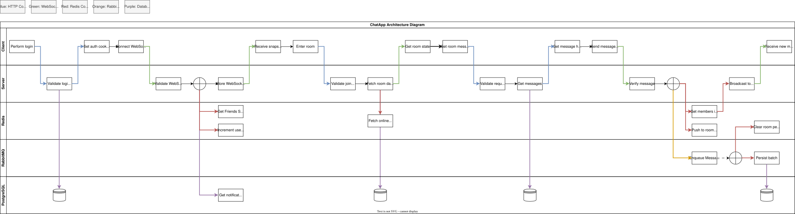

# ChatApp

It supports chat rooms, private DMs, role-based access control, invite-based room membership, friend requests, optional AES-256-GCM message encryption, 
and horizontally scalable WebSocket messaging using Redis Pub/Sub and RabbitMQ.
## [Access](https://chatapp.blikeng.com)

---

### SonarCloud Analysis

[](https://sonarcloud.io/summary/new_code?id=eskil4152_chatapp)
[](https://sonarcloud.io/summary/new_code?id=eskil4152_chatapp)
[](https://sonarcloud.io/summary/new_code?id=eskil4152_chatapp)
[](https://sonarcloud.io/summary/new_code?id=eskil4152_chatapp)
[](https://sonarcloud.io/summary/new_code?id=eskil4152_chatapp)

---

## Table of Contents

- [Tech Stack](#tech-stack)
- [Architecture](#architecture)
- [Features](#features)
  - [Authentication & Security](#authentication--security)
  - [Rate Limiting](#rate-limiting)
  - [WebSocket & Real-Time Messaging](#websocket--real-time-messaging)
  - [Distributed Messaging Pipeline](#distributed-messaging-pipeline)
  - [Message Encryption](#message-encryption)
  - [Friends & Direct Messages](#friends--direct-messages)
  - [Database & Persistence](#database--persistence)
  - [Room & User Management](#room--user-management)
  - [Invitations & Notifications](#invitations--notifications)
  - [Presence Tracking](#presence-tracking)
  - [Buffered Message Persistence](#buffered-message-persistence)
- [API Overview](#api-overview)
- [Deployment](#deployment)
- [CI/CD Pipeline](#cicd-pipeline)
- [Testing](#testing)
- [Load Testing](#load-testing)
- [Privacy](#privacy)
- [License](#license)

---

## Tech Stack

| Layer             | Technology                                |
|-------------------|-------------------------------------------|
| Language          | Kotlin                                    |
| Framework         | Spring Boot                               |
| Real-time         | WebSockets (Spring WebSocket)             |
| Auth              | JWT (HTTP-only cookie, `SameSite=Strict`) |
| Encryption        | AES-256-GCM                               |
| Password Hashing  | BCrypt                                    |
| Database          | PostgreSQL (schema managed via Flyway)    |
| Messaging         | RabbitMQ                                  |
| Distributed State | Redis                                     |
| Containerization  | Docker                                    |
| Cloud             | Azure Web App + Azure Container Registry  |
| CI/CD             | GitHub Actions                            |
| Rate Limiting     | Bucket4j                                  |
| Code Quality      | SonarCloud                                |
| Testing           | JUnit 6, MockK                            |
| Load Testing      | k6                                        |

---

## Architecture



The system separates real-time delivery (Redis Pub/Sub + WebSockets) from durable persistence (RabbitMQ + PostgreSQL), 
allowing the chat service to scale horizontally without coupling WebSocket throughput to database writes.

A more detailed architecture diagram is available [here](docs/ChatApp-low.svg).

---

## Features

### Authentication & Security

**JWT Authentication**
- Registration and login issue a signed JWT stored as an `HttpOnly`, `SameSite=Strict` cookie with a 24-hour expiration.
- The token encodes `userID` as the subject and `username` as a claim for efficient identity extraction.
- A dedicated `JwtAuthFilter` is responsible for all authentication checks.
- After token validation, user existence is re-verified in the database. A valid token for a deleted user results in a `400 Bad Request`.

**Password Handling**
- Passwords are hashed with **BCrypt**, plaintext passwords are never persisted.
- Password changes require the current password to be verified against the stored hash before a new hash is saved.
- A minimum length is enforced for both usernames and passwords during registration and password changes.

**WebSocket Handshake Authentication**
- An `AuthHandshakeInterceptor` intercepts every WebSocket request and validates the JWT from the cookie before any connection is established.
- `userID` and `username` are injected into the WebSocket session after validation.
- Room membership is verified before a user can join a WebSocket room session. Unauthorized or non-member connections are rejected.

---

### Rate Limiting

Rate limiting is applied at both the HTTP and WebSocket layers using **Bucket4j** token buckets.

**HTTP** — limits are per IP address:
| Endpoint                  | Limit          |
|---------------------------|----------------|
| `POST /api/login`         | 5 / minute     |
| `POST /api/register`      | 10 / minute    |
| `PUT /api/user/edit`      | 2 / minute     |
| `PATCH /api/user/edit/password` | 2 / minute |
| All other `/api/**` paths | 60 / minute    |

Exceeded requests return `429 Too Many Requests`.

**WebSocket**
- Chat messages are limited to **10 messages per minute** per user.
- Excess messages receive a structured WebSocket error response instead of being broadcast.

---

### WebSocket & Real-Time Messaging

- Messages are broadcast in real-time to all active sessions in a room.
- Room session state is managed with thread-safe data structures: `ConcurrentHashMap` for room-to-sessions mapping and `CopyOnWriteArraySet` for per-room session sets.
- Only `MESSAGE` events are persisted to the database. `JOIN` and `LEAVE` are broadcast-only.
- On room join, history is assembled from both the database and the current Redis message buffer to ensure no messages are missed between persistence batches.
- Fan-out broadcasts are dispatched to a dedicated virtual-thread executor, keeping the Redis NIO event loop unblocked under high connection counts.

**Session Liveness (PING/TTL)**
- Clients send a `PING` event at regular intervals. The server resets a per-session last-seen timestamp and responds with `pong`.
- A background sweep runs every **30 seconds** and closes any session that has not sent a `PING` in the last **60 seconds**.
- Closing a stale session triggers the normal disconnect flow — presence counters are decremented and friends/room members are notified — keeping online status accurate even when clients crash without a clean disconnect.

**WebSocket Events**

| Direction       | Type                | Description                                                        |
|-----------------|---------------------|--------------------------------------------------------------------|
| Client → Server | `MESSAGE`           | Send a chat message to a room                                      |
| Client → Server | `JOIN`              | Join a room WebSocket session                                      |
| Client → Server | `LEAVE`             | Leave a room WebSocket session                                     |
| Client → Server | `PING`              | Keep-alive heartbeat; resets session TTL                           |
| Server → Client | `MESSAGE`           | Chat message broadcast                                             |
| Server → Client | `JOIN` / `LEAVE`    | User join/leave announcement broadcast to room                     |
| Server → Client | `ROOM_JOINED`       | Full room snapshot (members, role, encryption) sent on room join   |
| Server → Client | `ROOM_PRESENCE`     | Lightweight online/offline update for a room member                |
| Server → Client | `ROOM_ACTION`       | Kick or ban notification sent to the target user                   |
| Server → Client | `ROOM_DELETED`      | Room deletion notification sent to all members                     |
| Server → Client | `FRIEND_PRESENCE`   | Friend online/offline status update                                |
| Server → Client | `FRIEND_SNAPSHOT`   | Full friend list with online status, sent on connect               |
| Server → Client | `FRIEND_ADDED`      | Notifies both sides when a friend request is accepted              |
| Server → Client | `FRIEND_REMOVED`    | Notifies both sides when a friendship is removed                   |
| Server → Client | `INVITE_RECEIVED`   | New invite notification with type, sender, and room details        |
| Server → Client | `INVITE_ACCEPTED`   | Notifies sender when their invite is accepted                      |
| Server → Client | `PENDING_INVITES`   | Full pending invite list snapshot sent on connect                  |
| Server → Client | `USER_ROLE_CHANGED` | Notifies user of a role promotion or demotion in a room            |
| Server → Client | `BANNED`            | Notifies user they have been banned from the application           |
| Server → Client | `pong`              | Response to client `PING`                                          |
| Server → Client | `ERROR`             | Structured error with HTTP status code and message                 |

---

### Distributed Messaging Pipeline

To support horizontal scaling and decouple real-time messaging from persistence, the application uses a Redis + RabbitMQ pipeline.

**Redis Pub/Sub**
- All WebSocket broadcasts are published to Redis channels (`room:{roomId}`).
- Targeted user notifications (kick, ban, room deletion, friend presence) are published to `user:{userId}` channels.
- Each instance subscribes to both channel patterns and routes messages to the appropriate local WebSocket sessions.
- This ensures messages reach users connected to different application instances.

**RabbitMQ Message Queue**
- Chat messages are asynchronously persisted through RabbitMQ.
- When a message is sent:
  1. The message is published to RabbitMQ.
  2. A background consumer batches messages and writes them to the database.
- Manual acknowledgements ensure messages are retried if persistence fails.

This architecture separates:
- **real-time delivery**
- **durable persistence**

---

### Message Encryption

Encryption is **optional** and configured per room.

- Rooms can enable **AES-256-GCM** encryption for all messages.
- Each encrypted message stores three fields: `ciphertext`, `nonce`, and `keyVersion`.
- **Additional Authenticated Data (AAD)** binds each message to its specific room, user, and message identifier.
- `keyVersion` allows for future key rotation without losing the ability to decrypt historical messages.

---

### Friends & Direct Messages

- Users can send and receive **friend requests**, which must be accepted before a friendship is established.
- Friendships are stored using deterministic identifiers to ensure consistency and prevent duplicates.
- Friends can open private DM conversations backed by the same WebSocket and persistence pipeline as rooms.
- Friend status is intentionally never exposed to non-friends. Looking up a non-friend returns the same response as a non-existent user, preventing user enumeration.
- `FRIEND_PRESENCE` notifications are published to each friend’s `user:{friendId}` Redis channel, ensuring delivery across all instances.
- When a friend request is accepted, both users receive a `FRIEND_ADDED` notification with the new friend’s profile and online status.
- When a friendship is removed, both users receive a `FRIEND_REMOVED` notification so clients can update their friend list immediately.
- On connect, a presence snapshot is sent to the session with the current online status of all friends.

---

### Database & Persistence

**Schema Management with Flyway**
- All tables are version-controlled through Flyway migration scripts, applied automatically on startup.

**Relational Modeling**
- Foreign keys link `users` and `rooms` to `user_rooms` and `chats`.
- The `user_rooms` join table is indexed for efficient lookups when fetching a user's rooms.
- Duplicate room memberships are prevented via database constraints and repository checks.

**DTOs**
- All API responses use Data Transfer Objects to decouple the API surface from the internal entity structure and minimize data exposure to clients.

---

### Room & User Management

**Rooms**
- Room membership is managed through an **invite-based system**. Users cannot join rooms directly without an invitation.
- Invites can be:
  - direct (sent to a specific user)
  - open (shared links with limited usage)
- Rooms support **role-based access control**:
  - `OWNER` — full control (delete room, manage roles, invites)
  - `ADMIN` — manage users and invites
  - `MEMBER` — participate in messaging
- Users can be promoted and demoted within a room based on role permissions.
- Room owners and admins can kick or ban members. Banned users cannot rejoin.
- Kick and ban actions notify the target user via real-time WebSocket events (`ROOM_ACTION`).
- When a room is deleted, all members receive a `ROOM_DELETED` WebSocket notification.
- Notifications are delivered via Redis pub/sub after transaction commit using `@TransactionalEventListener`.

**Users**
- Duplicate usernames are rejected with `409 Conflict`.
- Login with an unknown username or incorrect password returns `401 Unauthorized`.
- Users can retrieve and update their own profile fields (bio, avatar, etc.) and change their password.
- Account deletion preserves chat history — messages are reassigned to a sentinel `[deleted]` user rather than removed.
- Global role promotions and demotions send the affected user a `USER_ROLE_CHANGED` notification.
- Global bans send the affected user a `BANNED` notification.

---

### Invitations & Notifications

- The system uses a unified **invitation model** for both room access and friend relationships.
- Invitations have expiration timestamps and can be accepted or rejected.
- Open room invites support configurable usage limits.
- All invitation-related actions trigger real-time notifications:
  - `INVITE_RECEIVED` — includes invite ID, type, sender username, room name, and avatar URL, allowing the client to accept immediately
  - `INVITE_ACCEPTED`
- On WebSocket connect, a `PENDING_INVITES` snapshot is sent containing the full list of pending invites with all details.
- Notifications are delivered through Redis Pub/Sub and routed to active WebSocket sessions across instances.

---
### Presence Tracking

User presence is tracked using Redis.

- Each active user session increments a Redis counter.
- When sessions close, the counter is decremented.
- A user is considered online when the counter is greater than zero.
- Stale presence keys from previous server runs are cleared on startup.

Room presence events are broadcast to all members of a room when a user connects or disconnects.
On room join, a full `ROOM_JOINED` snapshot is sent to the joining session. Subsequent presence updates use a lightweight `ROOM_PRESENCE` event containing only the user ID and online status.

On WebSocket connect, a `FRIEND_PRESENCE` snapshot is sent to the session with the current online status of all friends, so clients have accurate presence state immediately without waiting for a change event.

**Snapshot delivery** is asynchronous and off the WebSocket handler thread. Friend presence and pending invite snapshots are fetched in parallel and delivered via virtual threads, so the handler returns immediately after a `SYNC` request. Friend online status is checked in a single Redis `MGET` rather than one round-trip per friend.

**Redis caching** is applied to per-user room lists, friend ID lists, and pending invite lists to reduce database pressure on connect and sync.

---

### Buffered Message Persistence

To reduce database write pressure and support high message throughput, message persistence is handled asynchronously.

**Redis Message Buffer**
- Messages are temporarily stored in Redis lists (`chat.peek.{roomId}`).
- This buffer allows newly joined users to retrieve messages that have not yet been persisted.

**RabbitMQ Batch Persistence**
- Messages are also published to a RabbitMQ queue.
- A background consumer batches messages and writes them to PostgreSQL.

**Flush Strategy**
Messages are persisted when either:

- A batch reaches a configured size threshold
- A periodic flush interval is reached

This design ensures:

- consistent message history
- reduced database write amplification
- resilience to transient database failures

---

## API Overview
| Method | Endpoint                        | Description                                                                  |
|--------|---------------------------------|------------------------------------------------------------------------------|
| POST   | /api/register                   | Register                                                                     |
| POST   | /api/login                      | Login                                                                        |
| POST   | /api/logout                     | Log out                                                                      |
| GET    | /api/auth                       | Check auth status                                                            |
| GET    | /api/rooms                      | List all rooms                                                               |
| POST   | /api/rooms/make                 | Create room                                                                  |
| PUT    | /api/rooms/edit                 | Edit room                                                                    |
| DELETE | /api/rooms/leave                | Leave room                                                                   |
| DELETE | /api/rooms/delete               | Delete room                                                                  |
| POST   | /api/rooms/action               | Kick or ban a user                                                           |
| DELETE | /api/rooms/unban                | Unban a user                                                                 |
| GET    | /api/rooms/{roomId}/bans        | Get banned users for a room                                                  |
| GET    | /api/rooms/{roomId}/members     | Get members and their roles for a room                                       |
| POST   | /api/rooms/changeRole           | Promote or demote a room member                                              |
| POST   | /api/rooms/dm                   | Make or get private room                                                     |
| GET    | /api/user                       | Get user info                                                                |
| PUT    | /api/user/edit                  | Edit user profile                                                            |
| PATCH  | /api/user/edit/password         | Edit password                                                                |
| DELETE | /api/user/delete                | Delete account                                                               |
| GET    | /api/chats/{roomId}             | Get message history (paginated: `page`, `size` — allowed sizes: 25, 50, 100) |
| GET    | /api/friends                    | Get all friends                                                              |
| DELETE | /api/friends/remove             | Remove friend                                                                |
| GET    | /api/friends/{userId}           | Get friend info                                                              |
| GET    | /api/invites/pending            | Get pending invites received by the current user                             |
| GET    | /api/invites/outgoing           | Get outgoing pending invites sent by the current user                        |
| POST   | /api/invites/friend             | Send a friend request                                                        |
| POST   | /api/invites/room               | Send a room invite to a specific user                                        |
| POST   | /api/invites/open               | Create an open room invite (returns invite ID)                               |
| POST   | /api/invites/respond            | Accept or reject an invite                                                   |
| WS     | /ws                             | WebSocket endpoint                                                           |

---

## Deployment

The application runs as a Docker container on Azure Web App, with Docker images built and tagged using the
Git commit SHA and stored in Azure Container Registry.

The CI/CD pipeline handles building, pushing, and redeploying the container automatically on every merge to `main`.

The server uses **graceful shutdown** with a 30-second drain window, allowing in-flight requests and active WebSocket sessions to close cleanly before the process exits.

---

## CI/CD Pipeline

Two GitHub Actions workflows run on the repository:

**`testing.yml`** — triggers on every pull request and merge to main:
- Executes the full Maven test suite
- Updates SonarCloud analysis

**`azure.yml`** — triggers on every merge to `main`:
- Builds the Docker image
- Pushes to Azure Container Registry
- Azure Web App picks up the new image and redeploys

```
Pull Request
    │
    ▼
Run Tests + SonarCloud
    │
    │ (merge to main only if all tests pass)
    ▼
Build Docker Image
    │
    ▼
Push to Azure Container Registry with SHA tag
    │
    ▼
Azure Web App redeploys with SHA tag
```

---

## Testing

The project has comprehensive test coverage including unit tests and full **end-to-end tests**, covering every component and the full
user flow, from registering to adding friends and chatting.

---

## Load Testing

Load tests use [k6](https://k6.io) against a single instance running with `--spring.profiles.active=load` (rate limiting disabled, test DB/Redis). 
All runs are warm (server pre-started). Results are from a MacBook Air M4.

The tests in order are: 
* login: logs in the user
* roomCreation: Creates 5 rooms per user, for sync and list
* wsSync: Connects via WebSocket, triggers presence, receives
   friends and invites snapshots
* roomList: Lists all rooms
* multiRoom: Creates many rooms per user, and assert they are listed
* wsMultiRoom: Splits up users in rooms, asserts messages are sent and received
* roomHistory: Lists all messages in a room
* wsRoom: Adds all users to a single room, and asserts messages are sent and received

### HTTP Tests

| Test                       | VUs  | Checks | avg    | p90    | p95    | Failures |
|----------------------------|------|--------|--------|--------|--------|----------|
| Login (bcrypt)             | 250  | 100%   | 824ms  | 1907ms | 2156ms | 0        |
| Login (bcrypt)             | 500  | 100%   | 1920ms | 4290ms | 4800ms | 0        |
| Login (bcrypt)             | 1000 | 100%   | 4470ms | 8130ms | 9620ms | 0        |
| Room creation              | 250  | 100%   | 51ms   | 151ms  | 196ms  | 0        |
| Room creation              | 500  | 100%   | 78ms   | 232ms  | 278ms  | 0        |
| Room creation              | 1000 | 100%   | 104ms  | 322ms  | 550ms  | 0        |
| Multi-room (create + list) | 250  | 100%   | 3ms    | 4ms    | 6ms    | 0        |
| Multi-room (create + list) | 500  | 100%   | 4ms    | 6ms    | 7ms    | 0        |
| Multi-room (create + list) | 1000 | 100%   | 125ms  | 284ms  | 387ms  | 0        |
| Room list                  | 250  | 100%   | 12ms   | 20ms   | 23ms   | 0        |
| Room list                  | 500  | 100%   | 7ms    | 18ms   | 21ms   | 0        |
| Room list                  | 1000 | 100%   | 18ms   | 36ms   | 44ms   | 0        |
| Room history               | 250  | 100%   | 19ms   | 29ms   | 33ms   | 0        |
| Room history               | 500  | 100%   | 19ms   | 32ms   | 39ms   | 0        |
| Room history               | 1000 | 100%   | 17ms   | 35ms   | 53ms   | 0        |

### WebSocket Tests

| Test                               | VUs  | WS connect avg | WS connect p95 | Check pass rate | Failures |
|------------------------------------|------|----------------|----------------|-----------------|----------|
| wsSync (friend + invite snapshot)  | 250  | 10ms           | 24ms           | 100%            | 0        |
| wsSync (friend + invite snapshot)  | 500  | 3ms            | 10ms           | 100%            | 0        |
| wsSync (friend + invite snapshot)  | 1000 | 2ms            | 4ms            | 100%            | 0        |
| wsRoom (1 shared room, fan-out)    | 250  | 2ms            | 2ms            | 100%            | 0        |
| wsRoom (1 shared room, fan-out)    | 500  | 42ms           | 73ms           | 100%            | 0        |
| wsRoom (1 shared room, fan-out)    | 1000 | OOM            | OOM            | OOM             | OOM      |
| wsMultiRoom (5 rooms, distributed) | 250  | 1ms            | 2ms            | 100%            | 0        |
| wsMultiRoom (5 rooms, distributed) | 500  | 57ms           | 107ms          | 100%            | 0        |
| wsMultiRoom (5 rooms, distributed) | 1000 | 247ms          | 610ms          | 100%            | 0        |

> wsRoom at 1000 VUs (all users in a single room) is the worst-case fan-out scenario — every message fans out to 1000 concurrent WebSocket writes simultaneously. 
> This exceeds the single-instance heap ceiling on the test machine. 500 VUs is the validated limit for this scenario.

### Mixed Traffic (realistic workload)

Simulates concurrent realistic traffic: 40% WS messaging, 20% WS sync, 20% room list, 10% room creation, 10% room history.

| VUs  | Checks | HTTP avg | HTTP p95 | WS connect avg | WS connect p95 | Failures |
|------|--------|----------|----------|----------------|----------------|----------|
| 250  | 100%   | 8ms      | 23ms     | 8ms            | 19ms           | 0        |
| 500  | 100%   | 10ms     | 27ms     | 7ms            | 19ms           | 0        |
| 1000 | 100%   | 6ms      | 20ms     | 3ms            | 8ms            | 0        |
| 2000 | 100%   | 5ms      | 11ms     | 4ms            | 10ms           | 0        |

### Multi-Instance Validation

Two instances running locally against shared PostgreSQL, Redis, and RabbitMQ:

| Scenario                                                       | Result |
|----------------------------------------------------------------|--------|
| Messages sent to instance A delivered to clients on instance B | Passed |
| Presence updates propagated across instances via Redis Pub/Sub | Passed |
| Invite and friend notifications routed to correct instance     | Passed |

These tests were performed locally on a single development machine. Results validate concurrency behavior and baseline performance, not production capacity.

---

## Privacy

This application is a personal hobby project.

- Data stored: username, hashed passwords, messages, friendships, and optional user profile fields.
- Data is not shared with third parties, but is stored on third-party infrastructure (e.g., cloud hosting, databases) for operation.
- Users may delete their account at any time.
- This service is provided as-is, with no guarantees of long-term storage, availability, or production-grade data protection.

---

## License

[MIT](LICENSE)